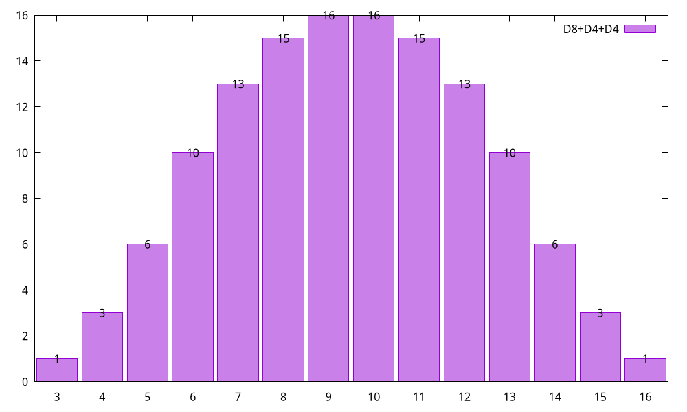

# Dicey

[](https://rubygems.org/gems/dicey)
[](https://github.com/trinistr/dicey/actions/workflows/CI.yaml)

> [!TIP]
> You may be viewing documentation for an older (or newer) version of the gem than intended. Look at [Changelog](https://github.com/trinistr/dicey/blob/main/CHANGELOG.md) to see all versions, including unreleased changes.

***

The premier solution in total paradigm shift for resolving dicey problems of tomorrow, today, used by industry-leading professionals around the world!

In seriousness, this program is mainly useful for calculating total frequency (probability) distributions of all possible dice rolls for a given set of dice. Dice in such a set can be different or even have arbitrary numbers on the sides. It can also be used to roll any dice that it supports.

## Table of contents

- [Online (no installation)](#online-no-installation)
  - [Recommended](#recommended)
  - [For those who want the full command line experience](#for-those-who-want-the-full-command-line-experience)
- [Installation](#installation)
  - [Requirements](#requirements)
- [Usage: CLI (command line)](#usage-cli-command-line)
  - [Example 1: Basic distribution](#example-1-basic-distribution)
  - [Example 2: Complex distribution with different dice](#example-2-complex-distribution-with-different-dice)
  - [Example 3: Custom dice](#example-3-custom-dice)
  - [Example 4: Rolling even more custom dice](#example-4-rolling-even-more-custom-dice)
  - [All ways to define dice](#all-ways-to-define-dice)
- [Usage: API](#usage-api)
  - [Dice](#dice)
  - [Rolling](#rolling)
  - [Distribution calculators](#distribution-calculators)
  - [Distribution properties](#distribution-properties)
- [Diving deeper](#diving-deeper)
- [Development](#development)
- [Contributing](#contributing)
- [License](#license)

## Online (no installation)

### Recommended

Use online version of **Dicey** on its own website: [dicey.bulancov.tech](https://dicey.bulancov.tech)!

It does not provide quite all features, but it's easy to use and quick to get started.

### For those who want the full command line experience

Thanks to the efforts of Ruby developers, you can run full **Dicey** online!
1. Head over to the prepared [RunRuby page](https://runruby.dev/gist/476679a55c24520782613d9ceb89d9a3).
2. Make sure that "*-main.rb*" is open.
3. Input arguments between "ARGUMENTS" lines, separated by spaces. Refer to [Usage / CLI](#usage--cli-command-line) section.
4. Click "**Run code**" button below the editor.
5. Results will be printed to the "Logs" tab.

If familiar with Ruby, you can also use **RunRuby** to explore the API. Refer to [Usage / API](#usage--api) section for documentation.

## Installation

Install manually via `gem`:
```sh
gem install dicey
```

Or, if using Bundler, add it to your `Gemfile`:
```rb
gem "dicey", "~> 0.14"
```

If intending to work with non-numeric dice, install **vector_number** too:
```sh
gem install vector_number
```

or add it to your `Gemfile`:
```rb
gem "vector_number"
```

> [!TIP]
> Versions upto 0.12.1 were packaged as a single executable file. You can still download it from the [release](https://github.com/trinistr/dicey/releases/tag/v0.12.1).

> [!NOTE]
> `dicey` 0.0.1 was a completely separate [project](https://github.com/rodreegez/dicey) by [Adam Rogers](https://github.com/rodreegez). Big thanks for transfering the name!

### Requirements

**Dicey** is tested to work on CRuby 3.0+, latest JRuby and TruffleRuby. Compatible implementations should work too.
- JSON and YAML formatting require `json` and `yaml`.
- Non-numeric dice require gem `vector_number` to be installed.

Otherwise, there are no direct dependencies.

## Usage: CLI (command line)

Following examples assume that `dicey` (or `dicey-to-gnuplot`) is executable and is in `$PATH`.

> [!NOTE]
> 💡 Run `dicey --help` to get a list of all possible options.

### Example 1: Basic distribution

Let's start with something simple. Imagine that your Bard character has Vicious Mockery cantrip with 2d4 damage, and you would like to know the distribution of possible damage rolls. Run **Dicey** with two 4s as arguments:
```sh
$ dicey 4 4
```

It should output the following:
```sh
# D4+D4
2 => 1
3 => 2
4 => 3
5 => 4
6 => 3
7 => 2
8 => 1
```

First line is a comment telling you that calculation ran for two D4s. Every line after that has the form `roll sum => frequency`, where frequency is the number of different rolls which result in this sum. As can be seen, 5 is the most common result with 4 possible different rolls.

If probability is preferred, there is an option for that:
```sh
$ dicey 4 4 --result probabilities # or -r p for short
# D4+D4
2 => 1/16
3 => 1/8
4 => 3/16
5 => 1/4
6 => 3/16
7 => 1/8
8 => 1/16
```

This shows that 5 will probably be rolled a quarter of the time.

### Example 2: Complex distribution with different dice

During your quest to end all ends you find a cool Burning Sword which deals 1d8 slashing damage and 2d4 fire damage on attack. You run **Dicey** with these dice:
```sh
# Note the shorthand notation for two dice!
$ dicey 8 2d4
# D8+D4+D4
3 => 1
4 => 3
5 => 6
6 => 10
7 => 13
8 => 15
9 => 16
10 => 16
11 => 15
12 => 13
13 => 10
14 => 6
15 => 3
16 => 1
```

Results show that while the total range is 3–16, it is much more likely to roll numbers in the 6–13 range. That's pretty fire, huh?

#### Example 2.1: Graph

If you downloaded `dicey-to-gnuplot` and have [gnuplot](http://gnuplot.info) installed, it is possible to turn these results into a graph with a somewhat clunky command:
```sh
$ dicey 8 2d4 -f g | dicey-to-gnuplot
# `--format gnuplot` is shortened to `-f g`
```

This will create a PNG image named "*D8+D4+D4.png*":


#### Example 2.2: JSON and YAML

If you find that you need to export results for further processing, it would be great if a common data interchange format was used. **Dicey** supports output as JSON and YAML with `--format json` (or `-f j`) and `--format yaml` (or `-f y`) respectively.

JSON via `dicey 8 2d4 --format json`:
```json
{"description":"D8+D4+D4","results":{"3":1,"4":3,"5":6,"6":10,"7":13,"8":15,"9":16,"10":16,"11":15,"12":13,"13":10,"14":6,"15":3,"16":1}}
```

YAML via `dicey 8 2d4 --format yaml`:
```yaml
---
description: D8+D4+D4
results:
  3: 1
  4: 3
  5: 6
  6: 10
  7: 13
  8: 15
  9: 16
  10: 16
  11: 15
  12: 13
  13: 10
  14: 6
  15: 3
  16: 1
```

### Example 3: Custom dice

While walking home from work you decide to take a shortcut through a dark alleyway. Suddenly, you notice a die lying on the ground. Looking closer, it turns out to be a D4, but its 3 side was erased from reality. You just have to learn what impact this has on a roll together with a normal D4. Thankfully, you know just the program for the job.

Having ran to a computer as fast as you can, you sic **Dicey** on the problem:
```sh
$ dicey 1,2,4 4
# (1,2,4)+D4
2 => 1
3 => 2
4 => 2
5 => 3
6 => 2
7 => 1
8 => 1
```

Hmm, this looks normal, doesn't it? But wait, why are there two 2s in a row? Turns out that not having one of the sides just causes the roll frequencies to slightly dip in the middle. Good to know.

But what if you had TWO weird D4s?
```sh
$ dicey 2d1,2,4
# (1,2,4)+(1,2,4)
2 => 1
3 => 2
4 => 1
5 => 2
6 => 2
8 => 1
```

Hah, now this is a properly cursed distribution!

> [!TIP]
> 💡 A single positive integer argument N practically is a shorthand for listing every side from 1 to N.

### Example 4: Rolling even more custom dice

You have a sudden urge to roll dice while only having boring integer dice at home. Where to find *the cool* dice though?

Look no further than **roll** mode introduced in **Dicey** 0.12:
```sh
$ dicey 0.5,1.0,1.5,2.0,2.5 4 --mode roll # As always, can be abbreviated to -m r
# (1/2,1,3/2,2,5/2)+D4
roll => 7/2 # You probably will get a different value here.
```

> [!NOTE]
> 💡 Roll mode is compatible with `--format` option.

### All ways to define dice

There are three *main* ways to define dice:
- *"5", "25", or "525"*: a single positive integer makes a regular die (like a D20).
- *"3-6", "-5..5", "(0-1)"*: a pair of integers with a separator, possibly in round brackets, makes a numeric die with integers in the range.
  - Accepted separators: "-", "..", "...", "–" (en dash), "—" (em dash), "…" (ellipsis).
- *"1,2,4", "(-1.5,0,1.5)", or "2,"*: a list of any numbers separated by commas, possibly in round brackets, makes an arbitrary numeric die.
  - Lists can end in a comma, allowing single-number lists.

*"D6", "d(-1,3)", or "d2..4"*: any definitions can be prefixed with "d" or "D". While this doesn't do anything on its own, it can be useful to not start a definition with "-".

*"2D6", "5d-1,3", or "277D(2..4)"*: any definitions can be prefixed with "*N*d" or "*N*D", where *N* is a positive integer. This creates *N* copies of the die.

## Usage: API

> [!Note]
> - Latest API documentation from `main` branch is automatically deployed to [GitHub Pages](https://trinistr.github.io/dicey).
> - Documentation for published versions is available on [RubyDoc](https://rubydoc.info/gems/dicey).

### Dice

There are 3 classes of dice currently:
- `Dicey::AbstractDie` is the base class for other dice, but can be used on its own. It has no restrictions on values of sides.
- `Dicey::NumericDie` behaves much the same as `Dicey::AbstractDie` (being its subclass), except for checking that all values are instances of `Numeric`. It can be initialized with an Array or Range.
- `Dicey::RegularDie` is a specialized subclass of `Dicey::NumericDie`. It is defined by a single integer *N* which is expanded to a range (1..*N*).

All dice classes have constructor methods aside from `.new`:
- `.from_list` takes a list of definitions and calls `.new` with each one;
- `.from_count` takes a count and a definition and calls `.new` with it specified number of times.

See [Diving deeper](#diving-deeper) for more theoretical information.

> [!NOTE]
> 💡 Using `Float` values is liable to cause precision issues. Due to in-built result verification, this **will** raise errors. Use `Rational` or `BigDecimal` instead. 

#### DieFoundry

`Dicey::DieFoundry#call` provides the interface for creating dice from Strings as available in CLI:
```rb
Dicey::DieFoundry.new.call("100")
  # same as Dicey::RegularDie.new(100)
Dicey::DieFoundry.new.call("2d6")
  # same as Dicey::RegularDie.from_count(2, 6)
Dicey::DieFoundry.new.call("1d1,2,4")
  # same as Dicey::NumericDie.from_list([1,2,4])
```

It only takes a single argument and may return both an array of dice and a single die. You will probably want to use `Enumerable#flat_map`:
```rb
foundry = Dicey::DieFoundry.new
%w[8 2d4].flat_map { foundry.call(_1) }
  # same as [Dicey::RegularDie.new(8), *Dicey::RegularDie.from_count(2, 4)]
```

### Rolling

`Dicey::AbstractDie#roll` implements the rolling:
```rb
Dicey::AbstractDie.new([0, 1, 5, "10"]).roll
  # almost same as [0, 1, 5, "10"].sample
Dicey::RegularDie.new(6).roll
  # almost same as rand(1..6)
```

Dice retain their roll state, with `#current` returning the last roll (or initial side if never rolled):
```rb
die = Dicey::RegularDie.new(6)
die.current
  # => 1
die.roll
  # => 3
die.current
  # => 3
```

Rolls can be reproducible if a specific seed is set:
```rb
Dicey::AbstractDie.srand(493_525)
die = Dicey::RegularDie.new(6)
die.roll
  # => 4
die.roll
  # => 1
# Repeat:
Dicey::AbstractDie.srand(493_525)
die = Dicey::RegularDie.new(6)
die.roll
  # => 4
die.roll
  # => 1
```

> [!NOTE]
> 💡 Randomness source is *global*, shared between all dice and probably not thread-safe.

### Distribution calculators

Distribution calculators live in `Dicey::SumFrequencyCalculators` module. There are four calculators currently:
- `Dicey::SumFrequencyCalculators::KroneckerSubstitution` is the recommended calculator, able to handle all `Dicey::RegularDie`. It is very fast, calculating distribution for *100d6* in about 0.1 seconds on a laptop.
- `Dicey::SumFrequencyCalculators::MultinomialCoefficients` is specialized for repeated numeric dice, with performance only slightly worse. However, it is currently limited to dice with arithmetic sequences.
- `Dicey::SumFrequencyCalculators::BruteForce` is the most generic and slowest one, but can work with *any* dice. It needs gem "**vector_number**" to be installed and available to work with non-numeric dice.
- `Dicey::SumFrequencyCalculators::Empirical`. This is more of a tool than a calculator. It can be interesting to play around with and see how practical results compare to theoretical ones. Due to its simplicity, it also works with *any* dice.

Calculators inherit from `Dicey::SumFrequencyCalculators::BaseCalculator` and provide the following public interface:
- `#call(dice, result_type: {:frequencies | :probabilities}, **options) : Hash`
- `#valid_for?(dice) : Boolean`

See [Diving deeper](#diving-deeper) for more details on limitations and complexity considerations.

### Distribution properties

While distribution itself is already enough in most cases (we are talking just dice here, after all). it may be of interest to calculate properties of it: mode, mean, expected value, standard deviation, etc. `Dicey::DistributionPropertiesCalculator` already provides this functionality:
```rb
Dicey::DistributionPropertiesCalculator.new.call(
  Dicey::SumFrequencyCalculators::KroneckerSubstitution.new.call(
    Dicey::RegularDie.from_count(2, 3)
  )
)
  # => 
  # {:mode=>[4],
  # :min=>2,
  # :max=>6,
  # :total_range=>4,
  # :mid_range=>4,
  # :median=>4,
  # :arithmetic_mean=>4,
  # :expected_value=>4,
  # :variance=>(4/3),
  # :standard_deviation=>1.1547005383792515,
  # :skewness=>0.0,
  # :kurtosis=>(9/4),
  # :excess_kurtosis=>(-3/4)}
```

Of course, for regular dice most properties are quite simple and predicatable due to symmetricity of distribution. It becomes more interesting with unfair, lopsided dice. Remember [Example 3](#example-3-custom-dice)?
```rb
Dicey::DistributionPropertiesCalculator.new.call(
  Dicey::SumFrequencyCalculators::KroneckerSubstitution.new.call(
    [Dicey::RegularDie.new(4), Dicey::NumericDie.new([1,3,4])]
  )
)
  # => 
  # {:mode=>[5],
  # :min=>2,
  # :max=>8,
  # :total_range=>6,
  # :mid_range=>5,
  # :median=>5,
  # :arithmetic_mean=>5,
  # :expected_value=>(31/6),
  # :variance=>(101/36),
  # :standard_deviation=>1.674979270186815,
  # :skewness=>-0.15762965389465178,
  # :kurtosis=>(23145/10201),
  # :excess_kurtosis=>(-7458/10201)}
```

This disitrubution is obviosuly skewed (as can be immediately seen from non-zero skewness), with expected value no longer equal to mean. This is a mild example. It is easily possible to create a distribution with multiple local maxima and high skewness.

## Diving deeper

For a further discussion of calculations, it is important to understand which classes of dice exist.
- **Regular** die — a die with N sides with sequential integers from 1 to N, like a classic cubic D6, D20, or even a coin if you assume that it rolls 1 and 2. These are dice used for many tabletop games, including role-playing games. Most probably, you will only ever need these and not anything beyond.

> [!TIP]
> 💡 If you only need to roll **regular** dice, this section will not contain anything important.

- **Natural** die has sides with only positive integers or 0. For example, (1,2,3,4,5,6), (5,1,6,5), (1,10000), (1,1,1,1,1,1,1,0).
- **Arithmetic** die's sides form an arithmetic sequence. For example, (1,2,3,4,5,6), (1,0,-1), (2.6,2.1,1.6,1.1).
- **Numeric** die is limited by having sides confined to ℝ (or ℂ if you are feeling particularly adventurous).
- **Abstract** die is not limited by anything other than not having partial sides (and how would that work anyway?).

> [!NOTE]
> 💡 If your die definition starts with a negative number, it can be bracketed, prefixed with "d", or put after "--" pseudo-argument to avoid processing as an option.

Dicey is in principle able to handle any real numeric dice and some abstract dice with well-defined summation (tested on complex numbers), though not every possibility is exposed through command-line interface: that is limited to floating-point values.

Currently, three algorithms for calculating frequencies are implemented, with different possibilities and trade-offs.

> [!NOTE]
> 💡 Complexity is listed for **n** dice with at most **m** sides and has not been rigorously proven.

### Kronecker substitution

An algorithm based on fast polynomial multiplication. This is the default algorithm, used for most reasonable dice.

- Limitations: only **natural** dice are allowed, including **regular** dice.
- Example: `dicey 5 3,4,1 0,`
- Complexity: **O(m⋅n)** where **m** is the highest value

### Multinomial coefficients

This algorithm is based on raising a univariate polynomial to a power and using the coefficients of the result, though certain restrictions are lifted as they don't actually matter for the calculation.

- Limitations: only *equal* **arithmetic** dice are allowed.
- Example: `dicey 1.5,3,4.5,6 1.5,3,4.5,6 1.5,3,4.5,6`
- Complexity: **O(m⋅n²)**

### Brute force

As a last resort, there is a brute force algorithm which goes through every possible dice roll and adds results together. While quickly growing terrible in performace, it has the largest input space, allowing to work with completely nonsensical dice, including aforementioned dice with complex numbers.

- Limitations: without **vector_number** all values must be numbers, otherwise almost any values are viable.
- Example: `dicey 5 1,0.1,2 1,-1,1,-1,0`
- Complexity: **O(mⁿ)**

## Development

After checking out the repo, run `bundle install` to install dependencies. Then, run `rake spec` to run the tests, `rake rubocop` to lint code and check style compliance, `rake rbs` to validate signatures or just `rake` to do everything above. There is also `rake steep` to check typing, and `rake docs` to generate YARD documentation.

You can also run `bin/console` for an interactive prompt that will allow you to experiment, or `bin/benchmark` to run a benchmark script and generate a StackProf flamegraph.

To install this gem onto your local machine, run `rake install`.

To release a new version, run `rake version:{major|minor|patch}`, and then run `rake release`, which will build the package and push the `.gem` file to [rubygems.org](https://rubygems.org). After that, push the release commit and tags to the repository with `git push --follow-tags`.

## Contributing

Bug reports and pull requests are welcome on GitHub at https://github.com/trinistr/dicey.

### Checklist for a new or updated feature

- Running `rake spec` reports 100% coverage (unless it's impossible to achieve in one run).
- Running `rake rubocop` reports no offenses.
- Running `rake steep` reports no new warnings or errors.
- Tests cover the behavior and its interactions. 100% coverage *is not enough*, as it does not guarantee that all code paths are tested.
- Documentation is up-to-date: generate it with `rake docs` and read it.
- "*CHANGELOG.md*" lists the change if it has impact on users.
- "*README.md*" is updated if the feature should be visible there.

## License

This gem is available as open source under the terms of the [MIT License](https://opensource.org/licenses/MIT), see [LICENSE.txt](https://github.com/trinistr/dicey/blob/main/LICENSE.txt).
